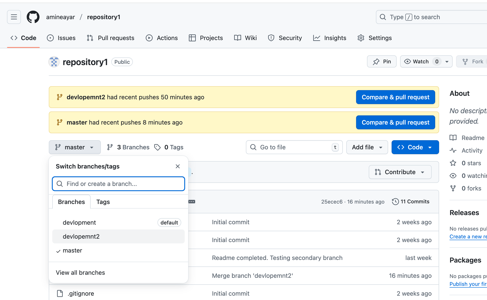

1. I created a new repository called "repository1" on my GitHub account.

2. I cloned the original project from A-Game-to-Fork  using GitKraken.

3.I changed the remote URL in GitKraken to point to my own repository (repository1)

4.I created two new branches: development and development2.

5.I edited the game code in these branches to add new functionalities and improvements.

6.I committed and pushed all changes to GitHub from GitKraken.

7.I merged both branches (development and development2) into my main branch master.

8.Finally, I deleted the old README.md and created this new one with explanations and screenshots.

